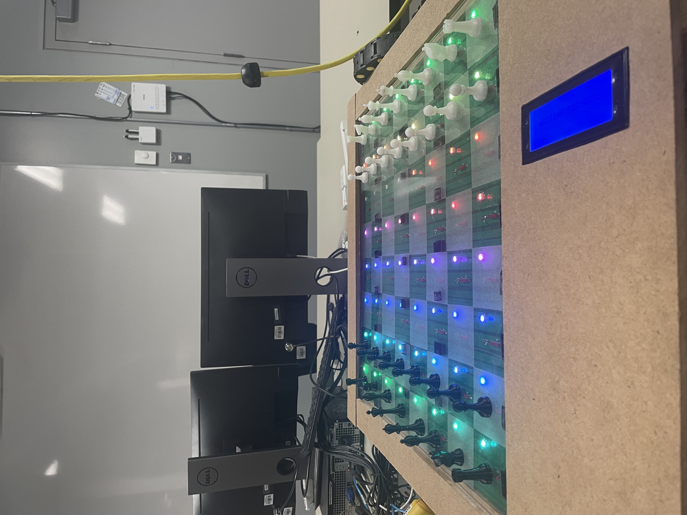
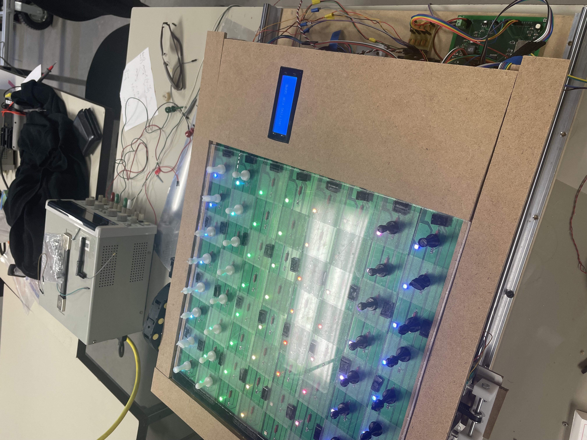

# ChessMatic: An Automatic Chessboard with ESP32

## Project Overview

This project is an automatic chessboard powered by an ESP32, designed to offer an interactive and autonomous chess experience. It features automatic movement of chess pieces with step motors and electromagnets, a smart Neopixel LED board for gameplay interactions, an LCD display to show game status, and a connection to an external application for remote control and gameplay. This project was developed as part of my integration project for my technical diploma in electronic programming.

  
  

## Features

- **Automatic Movement**: Chess pieces are moved automatically using step motors and electromagnets, allowing for a fully automated chess game.
- **Interactive Gameplay**: The smart Neopixel LED board provides visual feedback and interaction during the game, such as highlighting legal moves, turns, and check/checkmate status.
- **Game Status Display**: An LCD display is used to show important game information, such as the current player's turn, game status, and time remaining.
- **External Application Integration**: The chessboard connects to an external application for remote control and gameplay, enabling users to play against the AI or another player through the app.
- **ESP32**: The project is powered by an ESP32, providing Wi-Fi and Bluetooth connectivity for the external application.

## Hardware

- **ESP32**: The central controller that manages the chessboard's operation and communication with the external application.
- **Step Motors**: Used to move the chess pieces across the board.
- **Electromagnets**: Used to grip and move the chess pieces.
- **Neopixel LED Strip**: Provides visual feedback for gameplay.
- **LCD Display**: Shows game status information (e.g., player's turn, check status).
- **Power Supply**: Powers the ESP32, step motors, and other components.

## Software

- **ESP32 Firmware**: Developed using ESP-IDF with Platformio, handling motor control, communication, led display and game logic.
- **External Application**: Developed with Flutter (or other platforms), allowing users to control the chessboard remotely and play against the AI or other players.

  

